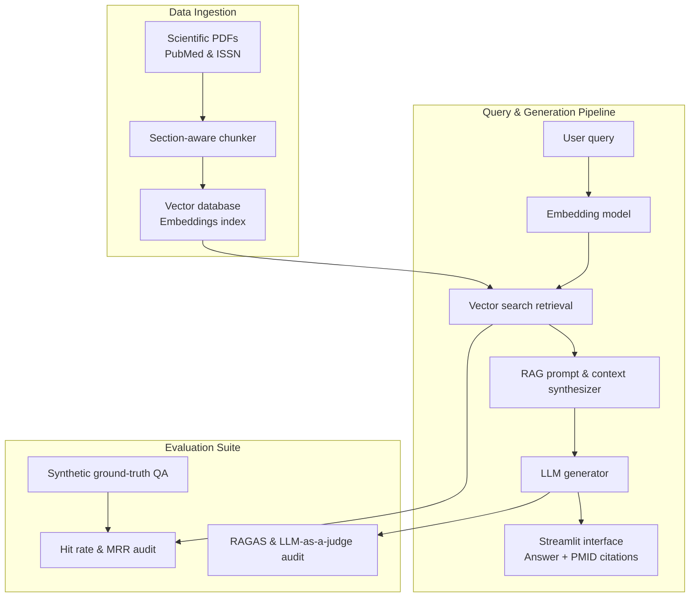

# Athletica 🏋️‍♀️
> Evidence-based nutrition and physiology assistant for female athletes

[](https://github.com/DataTalksClub/llm-zoomcamp)
[]()
[]()

Athletica is an end-to-end retrieval-augmented generation (RAG) system designed to answer complex queries on female athlete physiology, relative energy deficiency in sport (RED-S), iron metabolism, menstrual cycle phase nutritional adjustments, and ISSN consensus guidelines using curated peer-reviewed literature.

---

## Project overview

Scientific literature on female sports physiology is dense and distributed across PubMed review articles, clinical guidelines, and consensus statements. **Athletica** bridges the gap between academic research and practical application by providing an accurate, hallucination-audited assistant that backs every answer with exact **PMID citations and author attributions**.

### Key features
- 📄 **Section-aware PDF chunking:** Preserves scientific document hierarchy (introduction, methods, discussion, consensus recommendations) rather than arbitrary character splits.
- 🔍 **Semantic vector search:** High-precision vector indexing over embedded scientific passages.
- 📑 **Rigorous citation system:** Automatically extracts and appends PMID sources and authors to generated answers.
- 🧪 **Offline and online RAG evaluation:**
  - **Retrieval metrics:** Hit Rate@N and Mean Reciprocal Rank (MRR) evaluated against a synthetic ground-truth dataset.
  - **Generation metrics:** RAGAS framework (`faithfulness`, `answer_relevancy`, `context_precision`, `context_recall`) paired with custom LLM-as-a-judge Pydantic schemas.
- 🖥️ **Interactive web interface:** Streamlit UI for querying physiological guidance.

---

## Architecture and workflow



---

## Tech stack

- **Language:** Python 3.10+
- **LLM and embeddings:** OpenAI GPT-4o / HuggingFace Embeddings
- **Vector database:** Qdrant / ChromaDB
- **Evaluation framework:** RAGAS, Pydantic, custom LLM-as-a-judge
- **User interface:** Streamlit
- **Environment and package management:** `uv` / Docker

---

## Project structure

```text
capstone-project/
├── data/                  # Curated PubMed PDFs and ISSN consensus papers
├── notebooks/             # Data exploration and synthetic QA generation
├── src/
│   ├── chunker.py         # Section-aware PDF parser and chunker
│   ├── vector_store.py    # Vector database initialization and query methods
│   ├── rag_engine.py      # Core RAG pipeline and PMID citation formatter
│   └── evaluation.py      # Retrieval (Hit Rate, MRR) and RAGAS evaluation scripts
├── app.py                 # Streamlit UI web application
├── requirements.txt       # Dependencies
└── README.md              # Project documentation
```

---

## Evaluation strategy

Athletica follows a strict offline evaluation protocol to ensure scientific accuracy and prevent physiological hallucinations:

1. **Synthetic ground-truth dataset:** Generated by parsing scientific PDFs into section-aware chunks ($C_i$) with unique metadata (`pmid`, `authors`) and prompting an LLM to generate realistic athlete queries ($Q$) and reference answers ($A$).
2. **Chunk-level retrieval evaluation:** Assesses whether the exact target chunk ($C_i$) is returned in the top $K$ results using **Hit Rate@K** and **MRR**.
3. **Faithfulness and citation audit:** Uses LLM-as-a-judge scoring alongside **RAGAS** to ensure facts originate exclusively from retrieved passages and PMIDs are accurate.

---

## Roadmap and future extensions

- [x] **Phase 1 (Core RAG MVP):** PDF section chunking, vector retrieval, Hit Rate/MRR evaluation, LLM-as-a-judge audit, and Streamlit UI. *(In progress)*
- [ ] **Phase 2 (Agentic RAG):** Integrate custom Python calculation tools:
  - `calculate_energy_availability`: Calculates EA ($EA = \frac{\text{EI} - \text{EEE}}{\text{FFM}}$) to assess RED-S risk.
  - `issn_dosage_safety_checker`: Verifies supplement dosage safety against ISSN female athlete recommendations.

---

## Acknowledgements

Developed as the capstone project for the **[LLM Zoomcamp](https://github.com/DataTalksClub/llm-zoomcamp)** by DataTalksClub.
